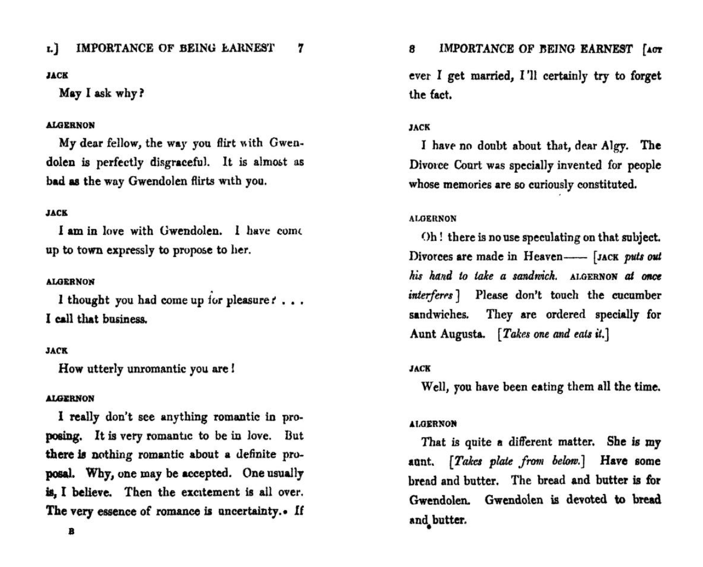
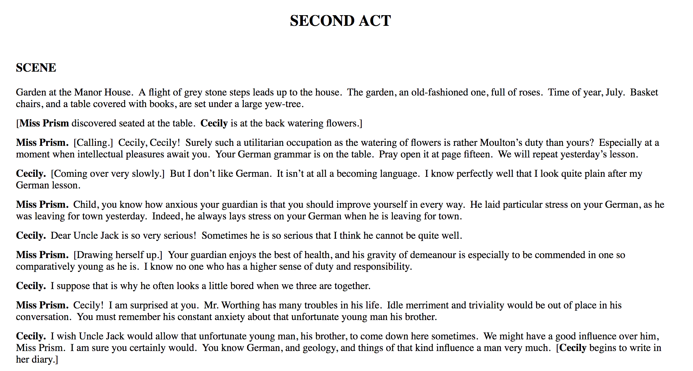

dasScript
===
or a reconfiguration of [Markdeep](https://casual-effects.com/markdeep) for making art-project/performance documents/manuals/scores.

# How to make your own
* Create a new document and save it as `.md.html`
* Add the following at the top of your document:
```
<meta charset="utf-8">
<title> PAGETITLE </title>
```
* Add the following at the bottom:
```
<script src="../markdeep.js?"></script><script>window.alreadyProcessedMarkdeep||(document.body.style.visibility="visible")</script>
```
* Then in the middle, add your work

# Formatting; or the symbols to manifest different elements
(subject to change)
~~~
You can put stage direction type stuff in these squiglies
~~~

*Character name type things go in between asterisks*

Embed media as following
```

```
For spoken word, put two greater than signs so it is as follows:
```
>
> Text to be spoken
```
And you can make diagrams!

# Background
This started with an inquiry into how playwrights should document their *plays*
And wondering why plays have looked the same for awhile.
For example, *The Importance of Being Earnest* [as published in a book](https://archive.org/details/in.ernet.dli.2015.553513/page/n19):


Or as you can see it [on Project Gutenberg](https://www.gutenberg.org/files/844/844-h/844-h.htm):



# Project Inquiry
Why is it that dialogue/text is the most valued element of a script?
There is much confusion in plays about **who** wrote the stage directions—the easily ignorable, sometimes said to be added by publishers descriptions of what happened in the original production, but sometimes the playwright is specific about them, but *Shakespeare* barely uses them!

My thinking is that it is intuitive to express oneself using sound, gifs, YouTube clips, text-animation effects, so why cant scripts accommodate?

And further, how do we share authorship of works created in a collaborative, horizontally structured ensemble? How do we allow each new production of a script add their contributions and discoveries. Whether that is alterations, dramaturgical research, rehearsal footage, choreography, projection/scenic design, etc?

# Where this is going
Right now, I'm basing this project in [Markdown](https://en.wikipedia.org/wiki/Markdown), taking certain formatting and with the power of [Markdeep](https://casual-effects.com/markdeep/) rendering it as an HTML document. It's a working model for easily creating web-page scripts, demonstrate that this concept of multimedia-accommodating, open-source documentation is an ideal, feasible, and form-moving-forward mechanism.
Next step would be to create an online script-making software for maximum intuitive creation & collaboration.
